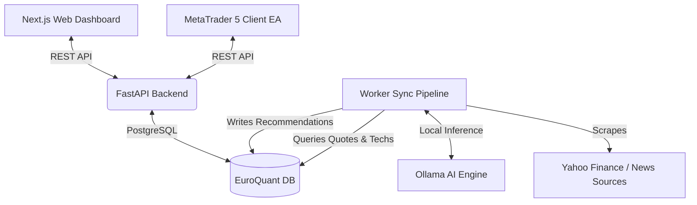

# EuroQuant: Professional Algorithmic Trading Bridge & Web Dashboard

EuroQuant is a professional-grade, containerized algorithmic trading ecosystem that bridges local AI models, advanced technical analysis, real-time market sentiment, and **MetaTrader 5 (MT5)** trading accounts. 

By analyzing micro-sentiment, macro-economic conditions, and quantitative indicators, EuroQuant produces trade recommendations that MetaTrader 5 Expert Advisors (EAs) poll and execute autonomously. A high-performance Web Terminal dashboard allows for manual signal overrides, backtesting simulation, and real-time visualization of indicators (including Bollinger Bands, RSI, MACD, and SMA) and signal history.

---

## 🛠️ System Architecture



The ecosystem is split into 5 core services:
1. **Frontend (`frontend/`)**: A Next.js Web Terminal styled with a premium dark-mode developer aesthetic, featuring chart controls (e.g. Bollinger Bands toggles), backtesting panels, and manual overrides.
2. **Backend (`backend/`)**: A FastAPI Gateway managing live client connections, active signal endpoints, and manual override tracking.
3. **Database (`db/`)**: A PostgreSQL instance initialized with schemas for stock prices, active clients, active recommendations, and recommendation history.
4. **Worker Pipeline (`worker/`)**: A python background orchestrator that scrapes financial reports and news sentiment, evaluates technical indicators, checks systemic risk (VSTOXX index), uses local Ollama instances to generate trade reasonings, and archives recommendations.
5. **MetaTrader 5 EA (`mt5_ea/`)**: MQL5 Expert Advisors (`EuroQuant_Bridge.mq5` and `EuroQuant_MultiSymbol_Bridge.mq5`) that poll the FastAPI backend to execute orders with dynamic Average True Range (ATR) based Stop Loss and Take Profit levels.

---

## ✨ Key Features

*   **MetaTrader 5 Bridge**: Standard and Multi-Symbol MQL5 Expert Advisors equipped with WebRequest poll capabilities, dynamic lot size calculations, and robust connection retries.
*   **Dynamic ATR Risk Management**: Stop Loss (SL) and Take Profit (TP) bounds are calculated on-the-fly based on a 15-period Average True Range (ATR) to adjust for current market volatility.
*   **Manual Signal Overrides**: An interactive control deck inside the web dashboard allows traders to override AI-generated signals with manual `BUY`, `SELL`, `HOLD` or `CLEAR` actions. The downstream MT5 EAs pick up the override immediately.
*   **Explainable AI (XAI)**: Generates structured, readable explanations categorized into **Micro Analysis** (sentiment & company news), **Macro Scenario** (market correlation & index impact), and **Technical Analysis** (moving averages & oscillators).
*   **Interactive Charts**: Custom ComposedCharts displaying historical prices, SMA overlaps, RSI levels, MACD histograms, and toggleable Bollinger Bands with dynamic client-side recalculation.
*   **Signal History Logs**: A timeline of past recommendations and sentiment scores is archived and displayed per asset.
*   **Systemic Volatility Filter**: Incorporates Eurozone systemic volatility protection using the **VSTOXX Index (^V2TX)**. When the volatility threshold is breached, buy recommendations are auto-blocked and forced to `HOLD` to protect capital.

---

## 🚀 Getting Started

### Prerequisites
*   Docker & Docker Compose installed on your system.
*   MetaTrader 5 terminal installed (running on Windows or via Wine on Linux).
*   Ollama running locally with the `llama3` model pulled:
    ```bash
    ollama pull llama3
    ```

### 1. Setup Environment
Clone the repository and inspect the configurations in `docker-compose.yml`. You can customize the news scrape loop interval using the environment variables in the `worker` service block:
```yaml
LOOP_INTERVAL_HOURS: 1  # Scraping frequency
OLLAMA_HOST: "http://host.docker.internal:11434" # Host Ollama address
```

### 2. Launch the Services
Spin up the backend, frontend, database, and background worker containers using Docker Compose:
```bash
docker compose up -d --build
```
Verify all containers are up and healthy:
```bash
docker compose ps
```

*   **Web Dashboard**: [http://localhost:3000](http://localhost:3000)
*   **API Documentation**: [http://localhost:8000/docs](http://localhost:8000/docs)

---

## 📈 MetaTrader 5 EA Configuration

To connect MetaTrader 5 to your local EuroQuant server:

1. Open MetaTrader 5.
2. Go to **Tools** > **Options** > **Expert Advisors**.
3. Check **Allow WebRequest for listed URL** and add:
   ```text
   http://localhost:8000
   ```
4. Copy `EuroQuant_Bridge.mq5` (for single-symbol EAs) or `EuroQuant_MultiSymbol_Bridge.mq5` (for multi-symbol bridge testing) into your MT5 directory:
   `MQL5/Experts/`
5. Compile the EA and attach it to your desired chart.
6. Configure the inputs:
   *   `Bridge_URL`: `http://localhost:8000/api/mt5/signals`
   *   `Ticker`: (e.g., `TEF.MC` for Telefónica, or matching symbol config)

---

## 📡 API Reference

### MT5 Signals
*   **`GET /api/mt5/signals`**
    *   **Description**: Invoked by MT5 EAs. Returns active recommendation, entry price, stop loss, take profit, and reasoning details. Automatically resolves manual overrides.
    *   **Parameters**: `ticker` (string, optional)

### Manual Overrides
*   **`GET /api/mt5/overrides`**
    *   **Description**: Returns all currently active manual overrides.
*   **`POST /api/mt5/overrides`**
    *   **Description**: Force a manual signal for a ticker symbol.
    *   **Payload**:
        ```json
        {
          "ticker": "TEF.MC",
          "action": "BUY" // BUY, SELL, HOLD, or CLEAR
        }
        ```

### Signal History Logs
*   **`GET /api/recommendations/history`**
    *   **Description**: Retrieves the historical timeline of recommendation logs for the requested asset.
    *   **Parameters**: `ticker` (string, required)

---

## 🔒 License
This repository is licensed under the MIT License. Feel free to modify and customize it for your personal trading systems.

