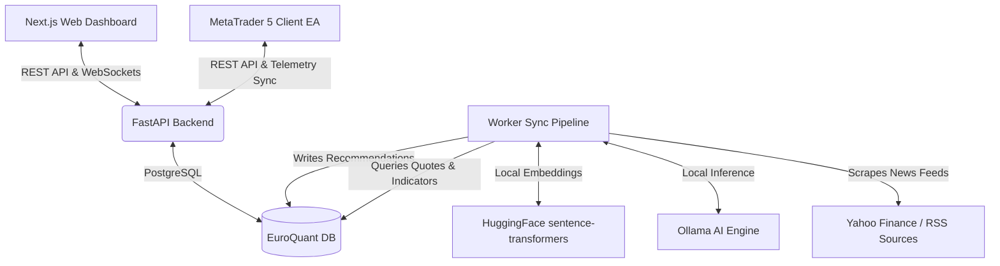

# EuroQuant: Professional Algorithmic Trading Bridge & Web Dashboard

EuroQuant is a containerized, institutional-grade algorithmic trading ecosystem that bridges local AI news sentiment, advanced quantitative indicators, real-time market telemetry, and **MetaTrader 5 (MT5)** client accounts.

By combining real-time news scraping, semantic text clustering, local Hugging Face embedding models, local LLM sentiment inference, and classic quantitative indicators, EuroQuant produces optimized trade signals. Local MetaTrader 5 Expert Advisors (EAs) poll these signals and execute orders autonomously. The system features a premium Web Terminal dashboard built with Next.js and Tailwind, offering real-time telemetry updates, backtesting simulations, manual override controls, and centralized emergency risk management.

---

## 🛠️ System Architecture



The ecosystem is split into 5 core services:
1. **Frontend (`frontend/`)**: A Next.js Web Terminal styled with a high-fidelity terminal developer aesthetic. Includes chart indicators (Bollinger Bands, RSI, MACD, SMAs), backtest parameter configuration, manual override triggers, and a real-time WebSocket connection.
2. **Backend (`backend/`)**: A FastAPI ASGI gateway managing live client connections, active signal endpoints, overrides, broker account telemetry sync, and WebSocket telemetry broadcasts.
3. **Database (`db/`)**: A PostgreSQL instance initialized with schemas for stock prices, news articles, recommendation logs, manual overrides, and MT5 broker account telemetry.
4. **Worker Pipeline (`worker/`)**: A Python background orchestrator that scrapes financial RSS feeds, clusters similar/duplicate news using a local Hugging Face embedding model (`all-MiniLM-L6-v2`), evaluates technical indicators (ADX, ATR, MACD, RSI, SMA), queries systemic risk (VSTOXX index), uses Ollama for sentiment analysis, and persists recommendation logs.
5. **MetaTrader 5 EA (`mt5_ea/`)**: MQL5 Expert Advisors (`EuroQuant_Bridge.mq5` and `EuroQuant_MultiSymbol_Bridge.mq5`) that poll the FastAPI backend, report broker account telemetry (equity, balance, margin, profit), resolve symbol suffixes dynamically, and execute orders with dynamic ATR-based Stop Loss and Take Profit levels.

---

## ✨ Enterprise Upgrades & Features

### 1. Server-side Backtesting Engine
The backtesting simulator runs entirely on the Python backend (`/api/backtest`). It evaluates trading performance across 250 daily periods by correlating historical price data, RSI indicators, and historical news sentiment scores. It computes key quantitative performance metrics including:
*   **Total return %** and **Benchmark buy-and-hold return %**
*   **Max Drawdown %**
*   **Sharpe Ratio** (annualized based on 252 trading days)
*   **Win Rate %**
*   **Equity Curve** time-series data plotted in real-time.

### 2. Real-Time WebSockets Communication Channel
The system establishes a full-duplex WebSocket connection (`/ws/telemetry`) between the web browser, the FastAPI backend, and the background worker. Whenever an EA checks in with telemetry or a manual override is engaged, the backend broadcasts a message. The React frontend immediately triggers a re-fetch of account balances, open positions, and active signals, rendering changes instantly.

### 3. Local Embeddings & News Clustering (Worker NLP)
To prevent duplicate stories from cluttering the dashboard and wasting local LLM resources, the background worker utilizes the **`sentence-transformers/all-MiniLM-L6-v2`** model. 
*   Scraped headlines are embedded locally on CPU/GPU.
*   Cosine similarity is computed for all unprocessed stories.
*   Stories with a similarity score $> 0.78$ are grouped.
*   Duplicate child articles share the parent's LLM sentiment score and ticker mapping, saving API/Ollama call latency.

### 4. Centralized Risk Control & Emergency Kill Switch
Centralized risk features protect capital from market anomalies:
*   **Aggregate Drawdown Check**: The backend automatically sums the balance and equity across all active MT5 accounts. If the aggregate drawdown exceeds the user-defined limit (e.g., $5.0\%$), a global risk state is triggered.
*   **Emergency Kill-Switch**: A global toggle on the dashboard allows immediate manual suspension of all trading.
*   **Downstream EA Close All**: When either risk limit is breached or the kill-switch is activated, all symbol signals are overridden with the `CLOSE_ALL` action. The downstream Expert Advisors pick up this status within their polling cycle, immediately close all open trades, and abort new order entry.

### 5. Dynamic Suffix Resolution & Spread threshold
*   **Suffix Handling**: Resolves broker suffix conventions dynamically (e.g. `ENI.CP` for Capital Point Trading Ltd) inside the EA, matching assets cleanly back to the database ticker.
*   **Dynamic Spread Control**: Orders are skipped if the broker spread exceeds the maximum threshold, dynamically configured as a percentage of the ask price (`InpMaxSpreadPercent`) or static point limits (`InpMaxSpreadPoints`).

---

## 🚀 Getting Started

### Prerequisites
*   Docker & Docker Compose.
*   MetaTrader 5 terminal installed on a Windows host or Wine on Linux.
*   Ollama running locally with the `llama3` model pulled:
    ```bash
    ollama pull llama3
    ```

### 1. Setup Environment
Clone the repository and inspect the configurations in `docker-compose.yml`. You can customize the news scrape loop interval and local Ollama endpoint using the environment variables in the `worker` service block:
```yaml
LOOP_INTERVAL_HOURS: 1  # Scraping frequency
OLLAMA_HOST: "http://host.docker.internal:11434" # Host Ollama address
DISABLE_FINBERT: "true" # Forces fallback to Ollama/Llama3 for reasoning
```

### 2. Launch the Services
Start the backend, frontend, database, and background worker containers:
```bash
sudo docker compose up -d --build
```
Verify all containers are up and healthy:
```bash
sudo docker compose ps
```

*   **Web Dashboard**: [http://localhost:3000](http://localhost:3000)
*   **API Documentation**: [http://localhost:8000/docs](http://localhost:8000/docs)

---

## 📈 MetaTrader 5 EA Configuration

To connect MetaTrader 5 to your local EuroQuant server:

1. Open MetaTrader 5.
2. Go to **Tools** > **Options** > **Expert Advisors**.
3. Check **Allow WebRequest for listed URL** and add:
   ```text
   http://localhost:8000
   ```
4. Copy `EuroQuant_Bridge.mq5` (for single-symbol EAs) or `EuroQuant_MultiSymbol_Bridge.mq5` (for multi-symbol trading) into your MT5 directory:
   `MQL5/Experts/`
5. Compile the EA and attach it to your desired chart.
6. Configure the inputs:
   *   `Bridge_URL`: `http://localhost:8000/api/mt5/signals`
   *   `Ticker`: (e.g., `TEF.MC` for Telefónica, or matching symbol config)
   *   `InpMaxSpreadPercent`: Dynamic spread threshold percentage of Ask (e.g. `0.05` for 0.05%). Set to `0` to fall back to static points.
   *   `InpMaxSpreadPoints`: Static spread threshold points (e.g. `100`).

---

## 📡 API Reference

### MT5 Signals & Telemetry
*   **`GET /api/mt5/signals`**
    *   **Description**: Invoked by MT5 EAs to fetch active recommendation signals, entries, Stop Loss, Take Profit, and reasoning details. Automatically checks global risk drawdowns, manual overrides, and the kill switch state.
    *   **Parameters**: `ticker` (string, optional)
*   **`POST /api/mt5/signals`**
    *   **Description**: Invoked by MT5 EAs to register/sync broker account telemetry.
    *   **Payload**:
        ```json
        {
          "account_id": 123456,
          "broker": "Capital Point Trading Ltd",
          "balance": 10000.00,
          "equity": 9850.00,
          "margin": 200.00,
          "margin_free": 9650.00,
          "margin_level": 4925.00,
          "profit": -150.00
        }
        ```

### Centralized Risk Settings
*   **`GET /api/mt5/risk`**
    *   **Description**: Retrieves current risk limits, kill switch active status, and current aggregate drawdown %.
*   **`POST /api/mt5/risk`**
    *   **Description**: Update maximum allowed aggregate drawdown percentage.
    *   **Payload**: `{ "max_drawdown_percent": 8.5 }`
*   **`POST /api/mt5/risk/kill-switch`**
    *   **Description**: Enable or disable the emergency kill switch.
    *   **Payload**: `{ "active": true }`

### Manual Overrides
*   **`GET /api/mt5/overrides`**
    *   **Description**: Returns all currently active manual overrides.
*   **`POST /api/mt5/overrides`**
    *   **Description**: Force a manual signal for a ticker symbol.
    *   **Payload**:
        ```json
        {
          "ticker": "TEF.MC",
          "action": "BUY" // BUY, SELL, HOLD, or CLEAR
        }
        ```

---

## 🔒 License
This repository is licensed under the MIT License. Feel free to modify and customize it for your personal trading systems.
